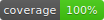

# tiny-event-bus




Zero-dependency, TypeScript-first event bus.

## Packages

| Package                                               | Description                                                                                                   |
| ----------------------------------------------------- | ------------------------------------------------------------------------------------------------------------- |
| [`@tiny-event-bus/core`](packages/core/README.md)             | Framework-agnostic event bus — type-safe, zero deps, fault-isolated, `on`/`once`/`emit`/`onAny`/introspection |
| [`@tiny-event-bus/replay`](packages/replay/README.md)         | Event replay plugin — buffer past events, auto-replay to late subscribers, history inspection                 |
| [`@tiny-event-bus/middleware`](packages/middleware/README.md) | Middleware plugin — intercept `emit()` calls, transform payloads, filter events, compose pipelines            |
| [`@tiny-event-bus/react`](packages/react/README.md)           | React hooks plugin — `useEvent`, `useEventBus`, `useAnyEvent`, `createBusContext` with auto-cleanup           |

Install only what you need. See each package README for install, API, and examples.

## Features

- **Type-safe** — full generic support, catch errors at compile time
- **Zero runtime deps** — core has no dependencies at all
- **Fault-isolated** — one bad handler can't break others
- **Plugin architecture** — install only the packages you need, add plugins independently

## Quick Start

```ts
import { createEventBus } from '@tiny-event-bus/core';

type AppEvents = {
  'toast:show': { message: string; severity: 'info' | 'error' };
  'shortcut:save': void;
};

const bus = createEventBus<AppEvents>();

bus.on('toast:show', (data) => {
  console.log(data.message); // fully typed
});

bus.emit('toast:show', { message: 'Saved!', severity: 'info' });
```

## Example App

A full shopping cart demo lives in [`examples/react/`](examples/react/) — shows state vs event bus side by side.

```bash
pnpm run example
```

See [examples/react/README.md](examples/react/README.md) for architecture and decision guide.

## Development

This is a pnpm workspace monorepo.

### Prerequisites

- **Node.js** >= 20
- **pnpm** >= 10 (via corepack: `corepack enable`)
- **gitleaks** for local secret scanning: `brew install gitleaks`

`pnpm install` auto-configures Git hooks (pre-commit for secret scanning, pre-push for coverage badge).

### Commands

```bash
pnpm install              # install all deps (workspace linking)
pnpm -r run build         # build all packages (ESM + CJS)
pnpm -r run test          # run all tests (70 tests across core + react)
pnpm run test:coverage    # run tests with v8 coverage (90% thresholds)
pnpm -r run typecheck     # type-check all packages
pnpm run lint             # ESLint
pnpm run format:check     # Prettier check
pnpm run example          # start the demo app (Vite dev server)
```

Per-package commands:

```bash
pnpm --filter @tiny-event-bus/core run test
pnpm --filter @tiny-event-bus/react run test
```

## License

MIT
